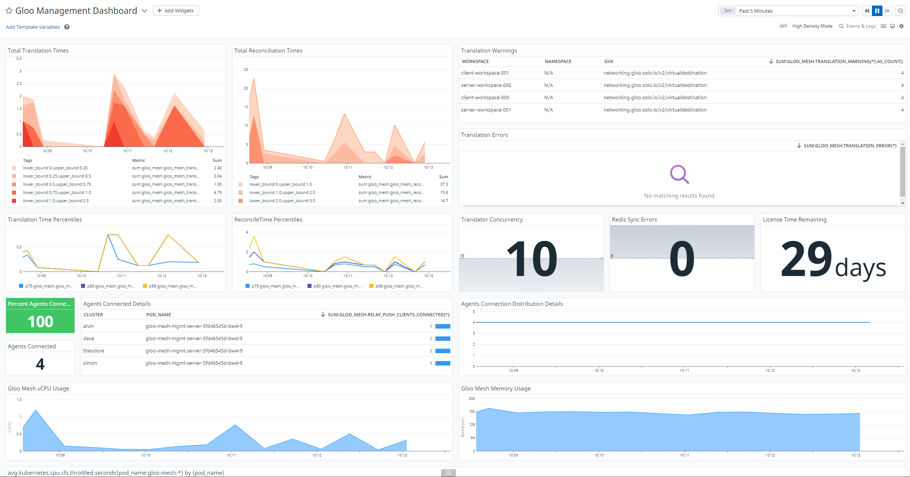

# Gloo Mesh / Istio Monitoring

*NOTE* There are many different ways to operate datadog. This is just an illustrative example.*NOTE*

# Basic Install

If you are already familiar with the Datadog install process you may skip this section.
[Install Documentation](https://docs.datadoghq.com/containers/kubernetes/installation/?tab=operator#installation)

1. Obtain/Generate an API_KEY [docs](https://docs.datadoghq.com/account_management/api-app-keys/#add-an-api-key-or-client-token)
1. Install `helm`
```
curl https://raw.githubusercontent.com/helm/helm/main/scripts/get-helm-3 | bash
```
1. Add the datadog helm repo
```
helm repo add datadog https://helm.datadoghq.com
helm repo update
```
1. Install the agent on each of your clusters:
```
helm upgrade --install datadog --create-namespace -n datadog  -f datadog-values.yaml --set datadog.site='datadoghq.com' --set datadog.apiKey='{{GENERATED_API_KEY}}' datadog/datadog
```



